<h1 align="center"> Eliptic Seizure Detection </h1>

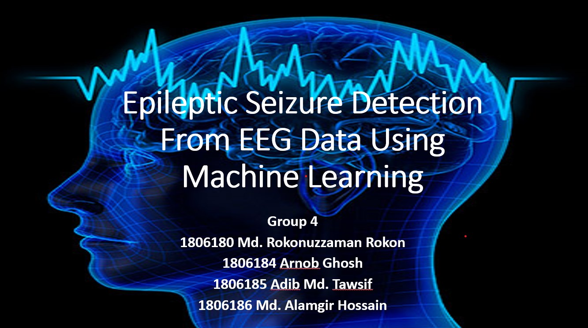

## About
It is an undergrad project for `Digital Signal Processing Lab`

## Abstract
Epilepsy is a major neurological disease characterized by recurrent seizures. Seizures can be caused by a variety of factors, including epilepsy, but they can also be caused by other diseases. EEG data can be used to distinguish between epileptic and non-epileptic seizures. In this study, we developed a CAD model for the detection of epileptic seizures using EEG data. We analyzed sets of EEG time series from healthy volunteers and epilepsy patients. The model was trained and tested on a dataset of EEG data from 100 patients. The model achieved an accuracy of 90%, indicating that it is a promising tool for the early detection of epileptic seizures.

The model was developed using a deep learning algorithm. The algorithm was trained on a dataset of EEG data from 100 patients. The dataset included both epileptic and non-epileptic seizures. The model was able to distinguish between the two types of seizures with an accuracy of 90%. This suggests that the model is a promising tool for the early detection of epileptic seizures.

The model could be used to improve the diagnosis of epilepsy. Early diagnosis is important for the treatment of epilepsy. The model could also be used to develop new treatments for epilepsy.

## Some Details
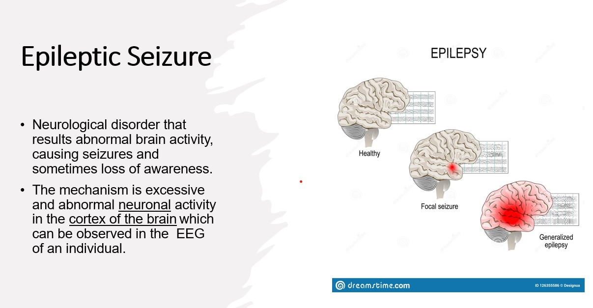
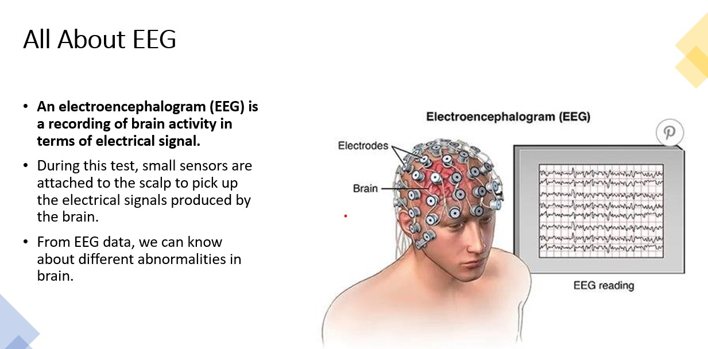

## Workflow
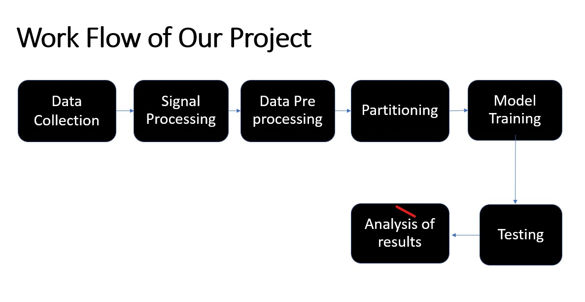
    
## Helping Links
- [Main Dataset](https://repositori.upf.edu/handle/10230/42894?fbclid=IwAR2YStcqFsgFCvX1vLPOILH9kAq9F6ZFj0OogHwbuDaCSHnd_LVjgQpHzFA)
- [Processed Dataset](https://www.kaggle.com/datasets/harunshimanto/epileptic-seizure-recognition?select=Epileptic+Seizure+Recognition.csv)
- [Notebook using NN](https://www.kaggle.com/code/ashishshaji/lstm-for-epileptic-seizures-prediction)
- [Notebook using SVM](https://www.kaggle.com/code/yatindeshpande/seizure-prediction-using-svm)
- [Signal Processing info](https://ieeexplore.ieee.org/document/8412847?fbclid=IwAR0UVzEA7zDQWmOu3V9Mnf6iojQKpHHc6Uxdyc7HtrKTwJK0DE_K5u3YK3s)
- [Report Link](https://github.com/alamgirakash2000/epileptic-seizure-detection-from-eeg/blob/main/reports/EEE312_report-group-04.pdf)
- [Presentation Slide](https://github.com/alamgirakash2000/epileptic-seizure-detection-from-eeg/blob/main/reports/EEE312-Final-Presentation.pptx)

## Dataset Description
The original dataset from the reference consists of 5 different folders, each with 100 files, with each file representing a single subject/person. Each file is a recording of brain activity for 23.6 seconds. The corresponding time-series is sampled into 4097 data points. Each data point is the value of the EEG recording at a different point in time. So we have total 500 individuals with each has 4097 data points for 23.5 seconds

We acquire publicly accessible EEG data from Bonn University, wherein the data include five sets(A,B,C,D and E). Each set consists of 100 single EEG segments with a sampling rate of 173.6 Hz. The EEG signals were filtered using a Bandpass filter and smoothing method. The first two sets (A,B) represent healthy people, whose signals were taken with open and closed eyes. The other three sets represent eliptic persons. Set (C, D) were treated as non-seizure because the signals are captured in duration without seizures. For seizure detection, set(E) was only treated as an eliptic seizure.
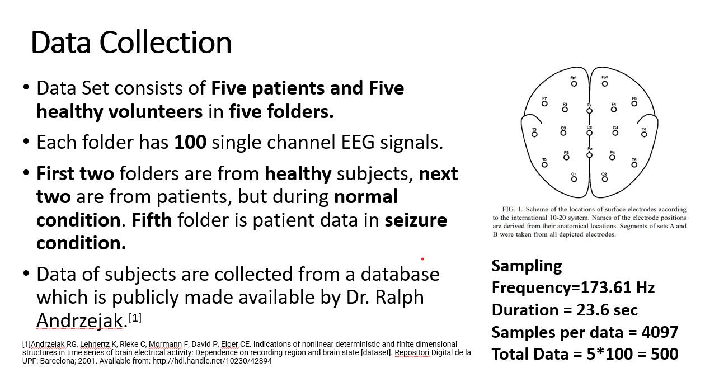

## Folder Description:
Main datasets has text files in total five different folders. Text files (.txt). Files: 
- For each set (A-E) there is a ZIP-file containing 100 TXT-files. 
- Each TXT-file consists of 4096 samples of one EEG time series in ASCII code. 
- SET A in file Z.zip containing Z000.txt - Z100.txt
- SET B in file O.zip containing O000.txt - O100.txt
- SET C in file N.zip containing N000.txt - N100.txt 
- SET D in file F.zip containing F000.txt - F100.txt 
- SET E in file S.zip containing S000.txt - S100.txt

## Filtering
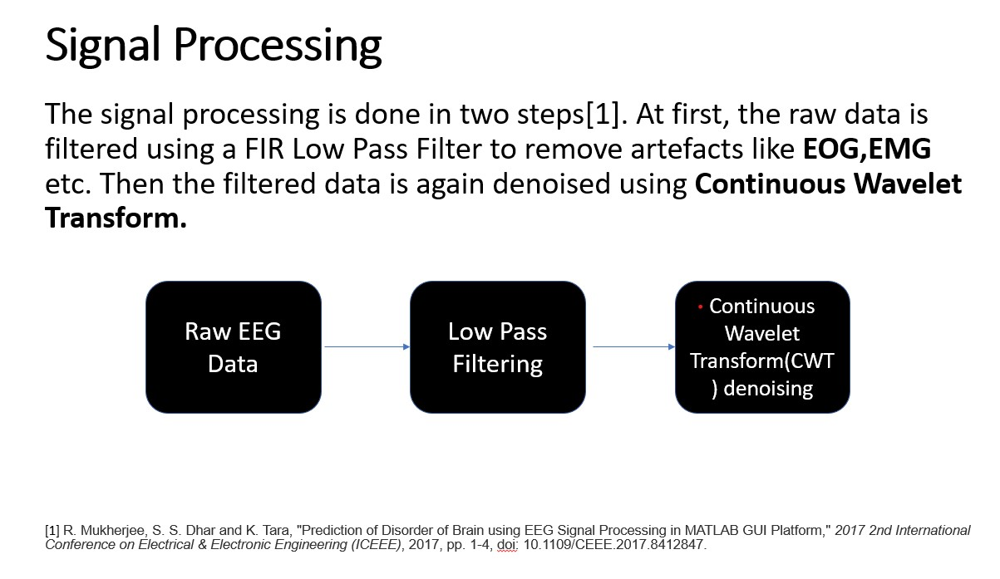
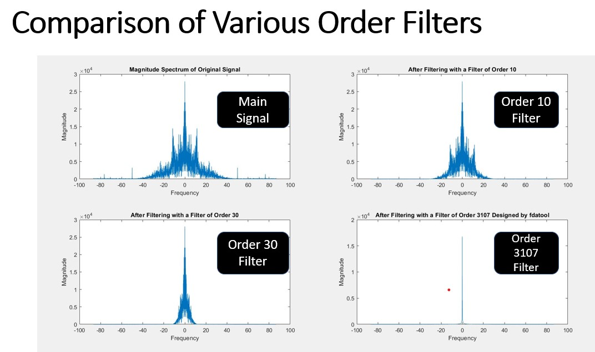

## Prepocessing
We divided and shuffled every 4097 data points into 23 chunks, each chunk contains 178 data points for 1 second, and each data point is the value of the EEG recording at a different point in time. So now we have 23 x 500 = 11500 pieces of information(row), each information contains 178 data points for 1 second(column), the last column represents the label y {1,2,3,4,5}.

The response variable is y in column 179, the Explanatory variables X1, X2, …, X178

y contains the category of the 178-dimensional input vector. Specifically y in {1, 2, 3, 4, 5}:

5 - eyes open, means when they were recording the EEG signal of the brain the patient had their eyes open

4 - eyes closed, means when they were recording the EEG signal the patient had their eyes closed

3 - Yes they identify where the region of the tumor was in the brain and recording the EEG activity from the healthy brain area

2 - They recorder the EEG from the area where the tumor was located

1 - Recording of seizure activity

All subjects falling in classes 2, 3, 4, and 5 are subjects who did not have epileptic seizure. Only subjects in class 1 have epileptic seizure. Our motivation for creating this version of the data was to simplify access to the data via the creation of a .csv version of it. Although there are 5 classes most authors have done binary classification, namely class 1 (Epileptic seizure) against the rest.ocessing
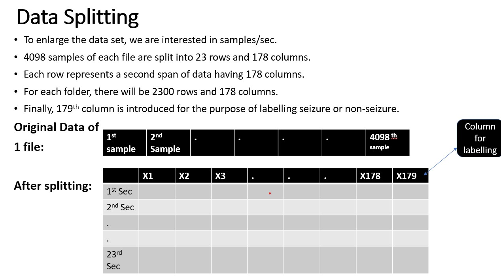
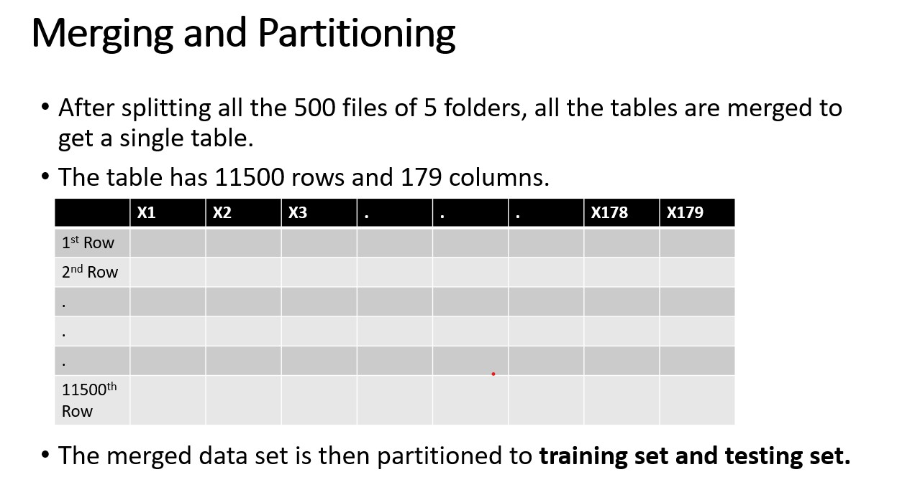

## Created Model result for per second data
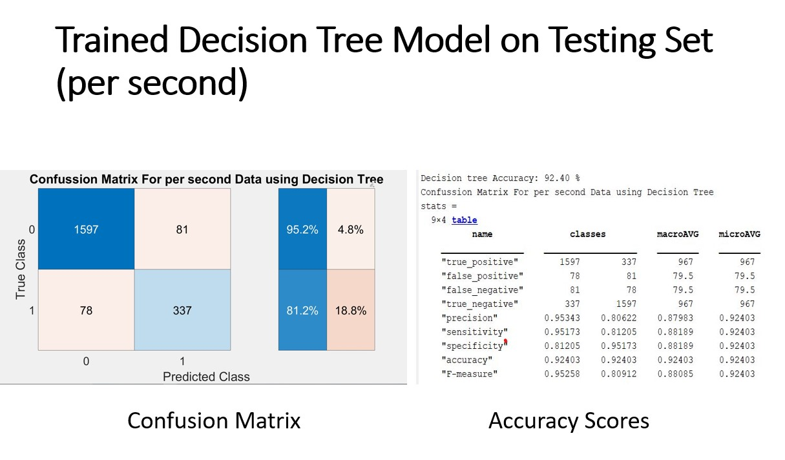
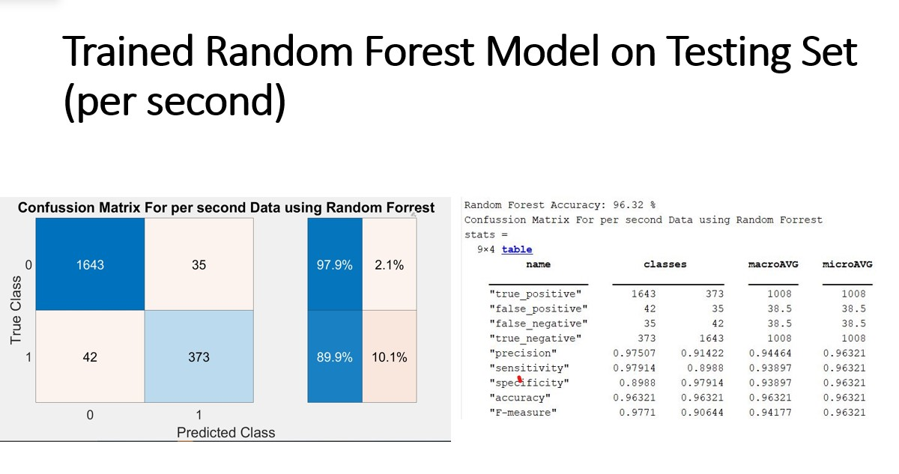

## Result with the overall EEG signal
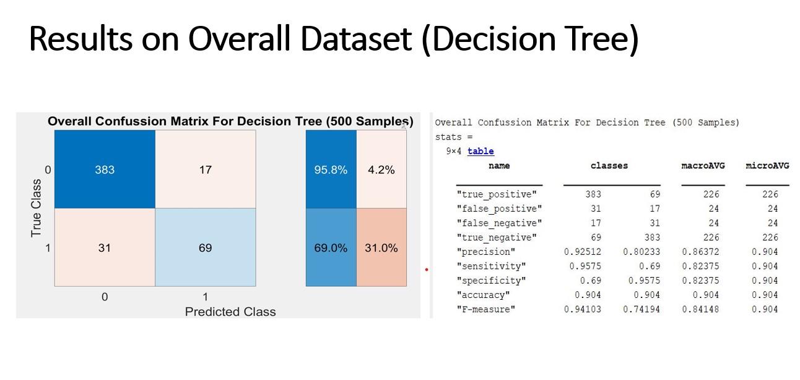
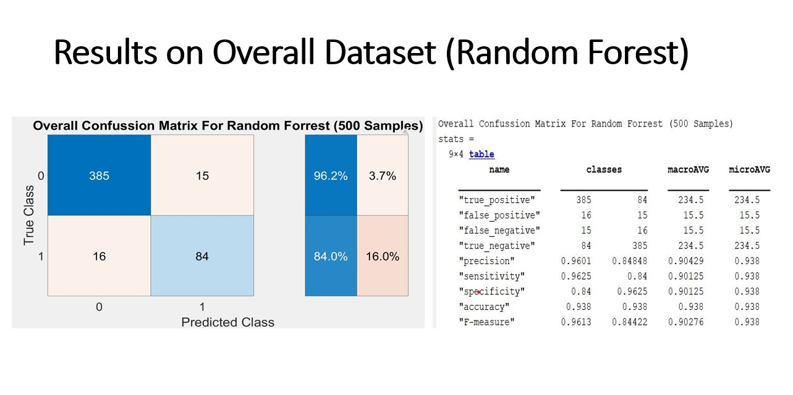

## The Team

